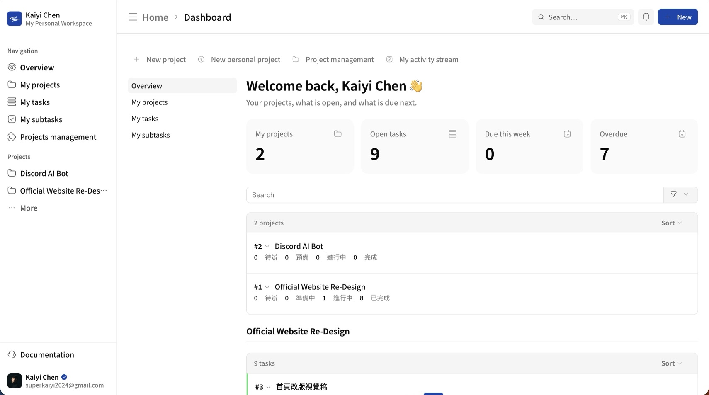
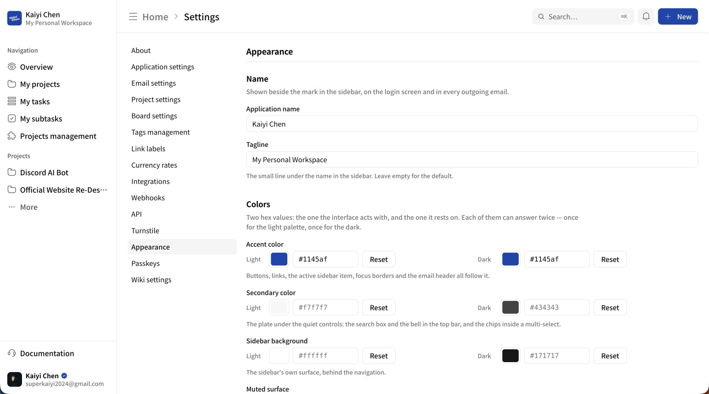
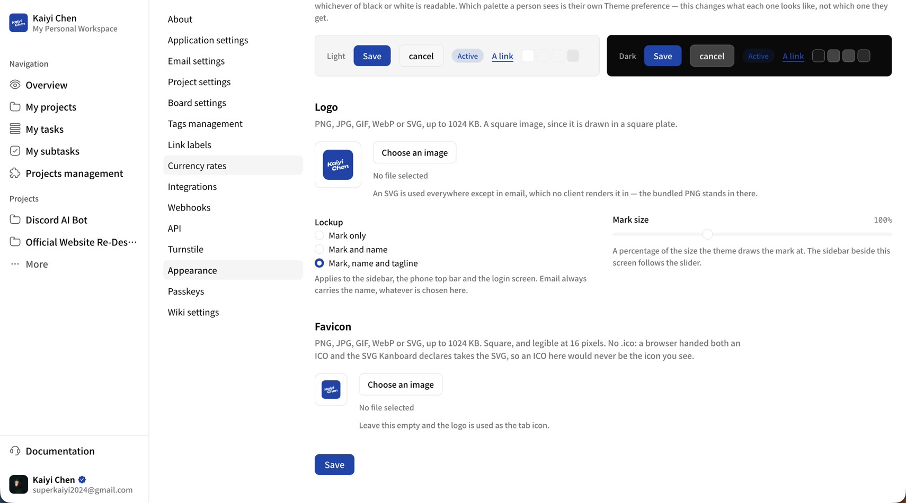

# Shadcn — 給 Kanboard 的 shadcn/ui 佈景主題

[English](README.md) · **繁體中文** · [日本語](README.ja.md)

用 [shadcn/ui](https://ui.shadcn.com) 的設計語言重寫整個 Kanboard 介面，並把內建的
Font Awesome 圖示換成 [HugeIcons](https://hugeicons.com)。亮色與暗色都有，跟著每位使用者
自己在 Kanboard 裡選的佈景主題走。

**不改任何核心檔案，也不覆寫任何模板**，所以 Kanboard 可以在它底下乾淨地升級。幾乎全部都是
樣式表；唯一的例外是側邊欄，那是外掛自己畫進 Kanboard 既有 hook 的一段標記。



---

## 安裝

Kanboard 外掛就是 `plugins/` 底下的一個資料夾，而資料夾名稱就是外掛的命名空間——所以不論
用哪種方式，這個外掛都必須落在 `plugins/Shadcn`。

**用 git** — 之後好更新的那種：

```
cd /path/to/kanboard/plugins
git clone https://github.com/heykaiyi/kanboard-shadcn-ui.git Shadcn
```

之後 `git -C plugins/Shadcn pull` 就能拿到下一版。

**用 zip** — 給沒有 shell 的主機：

```
unzip Shadcn-x.y.z.zip -d /path/to/kanboard/plugins
```

壓縮檔裡面已經包了 `Shadcn/` 那一層，所以直接解到 `plugins/` 就對了。同一個檔案也能餵給
**設定 → 外掛 → 從網址安裝**（需要開啟 `PLUGIN_INSTALLER`）：Kanboard 會下載壓縮檔並解到
`plugins/`，跟上面那道指令做的事情一模一樣。

裝完重新整理頁面即可——Kanboard 在下一個 request 就會認得它，沒有快取要清，也沒有 migration
要跑。每位使用者原本在 **設定 → 我的個人資料 → 佈景主題** 選的（亮色／暗色／自動）就決定他看到
哪一套配色，而一個沒動過任何設定的安裝，看起來就是它出廠的樣子。

想把它變成你自己的，去 **設定 → 外觀**（`/settings/brand`）——見下方。

要移除就刪掉那個資料夾。外面的東西一概不動：品牌設定存在 Kanboard 自己的 `settings` 資料表，
兩張上傳的圖在 `data/files/shadcn/`，所以移除外掛不會帶走它們，裝回來也還找得到。

### 需求

Kanboard 1.2.0 以上，以及 2023 年以後的瀏覽器——`oklch()`、`color-mix()` 與 `:has()`
到處都在用。在更舊的瀏覽器上，側邊欄會退化成頁面上方的一個普通區塊，也就是原本的堆疊版面，
一樣完全能用。

---

## 運作方式

一切建立在關於 Kanboard 的兩件事上。

**1. Kanboard 本來就是用 CSS 自訂屬性做佈景主題的。**`assets/css/src/themes/*.css` 定義了
約 90 個變數（`--button-primary-background-color`、`--dropdown-border-color`……），其他
約 60 個核心樣式表都在消費它們。`Assets/css/tokens.css` 宣告 shadcn 的 token，然後
*把每一個 Kanboard 變數改用這些 token 重新定義*：

```css
--primary: oklch(0.205 0 0);          /* shadcn */
--button-primary-background-color: var(--primary);   /* 橋接 */
```

一個橋接檔就重新皮了看板、分析、甘特圖、行事曆，以及這個外掛從頭到尾沒點名過的每一個畫面。

**2. 外掛的樣式表最後載入。**`app/Template/layout.php` 渲染 `template:layout:css` hook 的
時機在 vendor CSS 之後、佈景 CSS 之後、instance 樣式表之後，所以同權重的規則不必靠
`!important` 就能贏：

```
vendor.min.css → light|dark|auto.min.css → customCss() → [tokens, components, icons] → [theme-dark|auto]
```

暗色 token 是唯一沒辦法當靜態檔的東西——那是每位使用者各自的選擇——所以
`Template/layout/head.php` 在 `template:layout:head` hook 上挑出它們。

**3. `template:layout:top` 渲染在 `<body>` 裡面、其他所有東西之上。**側邊欄就放在那裡，於是
它成為 Kanboard 自己的 `<header>` 與 `<section class="page">` 的兄弟節點——是加上去的，
從來不是覆寫。

### 從一個 header 長出側邊欄

Kanboard 沒有全域導覽可以重新樣式化。它有的是一個 header：

```html
<header>
  <div class="title-container">…            頁面標題
  <div class="board-selector-container">…   跳到另一個專案
  <div class="menus-container">…            通知、新增、使用者
```

`sidebar.css` 把 `<body>` 變成 grid，然後設 `header { display: contents }`，這會讓
`<header>` 這個盒子消失，把那三個 div 提升進那個 grid。於是每一個都能被放到頁面上任何位置——
使用者選單放進側邊欄底部，其餘的放進頂端列——同時保留它自己的標記、自己的 JavaScript、自己的
擴充 hook。沒有東西被複製一份，也沒有東西被重新實作。

導覽本身是 Kanboard 給不出來的部分，所以由 `Template/layout/sidebar.php` 渲染：儀表板、
目前專案的各個檢視（只列出真的有安裝且有權限的），以及使用者的專案清單。
`Helper/SidebarHelper.php` 負責解出目前的專案與目前的路由，因為 `template:layout:top`
是不帶任何參數渲染的。

`Assets/js/sidebar.js` 是這個佈景唯一附帶的腳本。它把側邊欄收合成 3rem 的圖示軌，把這個選擇
記在 `localStorage`，在 768px 以下把它變成蓋在頁面上的抽屜，並綁定 Cmd/Ctrl-B——你正在打字時
會忽略，所以永遠不會從編輯器手上搶走「粗體」。它在 `<head>` 就把狀態寫到 `<html>` 上，早於
`<body>` 被解析，所以收合過的側邊欄不會在載入時閃一下又展開。

### 不碰模板也能換圖示

Kanboard 吐出 `<i class="fa fa-cog">` 然後用圖示字型畫它。那些 class 名稱有一半根本沒出現在
任何模板裡；它們是傳給 `$this->url->icon('cog', …)` 的字串。所以與其改寫模板，`icons.css`
選擇保留標記、重畫那個盒子：

```css
.fa-cog::before { content: none }
.fa-cog {
    background-color: currentColor;
    mask-image: url("data:image/svg+xml,…");   /* HugeIcons 的路徑 */
}
```

圖示因此繼承 `color` 與 `font-size`，每一個 Font Awesome 修飾子照常運作（`fa-2x`、`fa-fw`、
`fa-spin`、`fa-rotate-90`、`fa-inverse`），而後來被 Ajax 插進來的標記完全不需要 JavaScript
就有樣式。沒有對應的 `fa-*` class 一律不動，繼續用原本的字型渲染，所以不會有東西憑空消失。

一共對應了 138 個圖示：核心用到的每一個，加上第三方外掛常拿來用的 Font Awesome 4 名稱。

---

## 品牌設定

**設定 → 外觀**（`/settings/brand`），僅限管理員。八個項目，而且刻意只有八個：

| | |
|---|---|
| **網站名稱** | 側邊欄標誌旁的字、登入頁抬頭，以及每一封信的寄件者名稱。 |
| **副標題** | 側邊欄名稱下方那行小字。 |
| **主題色** | 一組十六進位色碼，可以用色票挑或直接打。按鈕、連結、側邊欄目前所在項目、聚焦邊框與信件標頭。亮色與暗色各答一次。 |
| **次要色** | 安靜控制項底下的那塊底：頂端列的搜尋框與通知鈴，以及多選欄位裡的標籤。同樣兩個答案。 |
| **標誌** | PNG、JPG、GIF、WebP 或 SVG，上限 1 MB。畫在側邊欄、登入頁，以及每封信的開頭。 |
| **顯示方式** | 要畫出多少：只有標誌、標誌加名稱，或標誌、名稱加副標題。 |
| **標誌大小** | 佈景原本尺寸的 50–200%。 |
| **網站圖示** | 同樣的格式。留白的話就拿標誌當分頁圖示。 |

全部都是選填；欄位留白就等於內建預設值，所以「重設」跟「從沒設過」是同一個狀態。



這個畫面會在你按下儲存之前就先回答你：色票和十六進位欄位是同一個值的兩種樣子，預覽列把顏色
畫成按鈕、徽章與連結——連佈景會替它算出來的黑字或白字都算好了——而選好的圖片在上傳之前就已經
畫在它的底板裡。顯示方式與標誌大小的預覽更直接：站在畫面旁邊的那條側邊欄*就是*預覽，會跟著
radio 與滑桿即時變。這些全都出自 `Assets/js/branding.js`，而且沒有一項是必要的：沒有
JavaScript 的話，色票就只是一個不會被送出的第二個輸入欄。



### 顯示方式與大小

一個本身已經含了字標的標誌，不會想要旁邊再印一次名字；一個名字才是重點的站台，也不會想要
名字下面再掛一行副標題。所以那三個 span 永遠都會渲染，選項只是一段把不要的藏起來的樣式片段——
這也是為什麼品牌連結都帶了 `aria-label`，以及為什麼預覽的成本只是一個 `<style>` 元素。
信件是例外：它一律帶名稱，因為一封來自一張圖片的通知，等於不知道是誰寄的。

**標誌大小**是倍率，不是長度。每個地方都用自己的基準畫那個標誌——側邊欄 2rem、登入頁
2.25rem——而 `--sc-brand-scale` 同時推動它們，又不會把它們壓成同一個尺寸。側邊欄的品牌那一列
用的是 `min-height`，所以放到 200% 時是把列撐高，而不是被裁掉。

### 為什麼是兩個顏色而不是四十個

主題色會被寫進 `--primary`、`--sidebar-primary` 與徽章填色，而疊在它上面的文字是*算出來的*
——黑與白兩者對它的 WCAG 對比中比較高的那一個——而不是預設為白色。所以一個很淺的品牌色會得到
深色的按鈕文字，而不是一顆看不清楚的按鈕。信件內文也跑同一道防線：連結只有在該色於白底上
達到 4.5:1 時才會採用它，否則保留預設的藍。

次要色不是一個跟主題色打對台的第二品牌色。它就是 `--secondary`，那些*不是*頁面主要動作的
控制項底下的那塊底：頂端列的搜尋框與通知鈴，以及多選欄位裡的標籤。它的前景色用同一套方式算，
而搜尋框的字是從那塊底自己的墨色往底色混出來的，不是寫死的灰，所以不論你把它設成很濃的顏色
還是佈景原本的近白，都還讀得到。

這兩個顏色各答兩次——亮色一次、暗色一次——因為在白底上好看的顏色，不一定就是晚上好看的那一個。
暗色欄位留白的意思是「晚上也用同一個顏色」，也就是在有兩個答案之前每個站台原本的樣子。誰看到
哪一套，是他自己在 **設定 → 我的個人資料 → 佈景主題** 決定的；這裡只決定兩套各自長什麼樣。
暗色答案輸出的位置，跟佈景自己的暗色 token 完全一樣：「暗色」直接輸出，「自動」包在
`prefers-color-scheme` 後面，「亮色」則完全不輸出。

其餘的配色維持推導而來。一個每個 token 都給一個選色器的設定畫面，是把站台弄醜的方法，不是
把它變成有品牌的方法。

### 圖片放在哪裡

在 `data/files/shadcn/`，跟其他所有上傳放在一起——外掛資料夾在升級時會被整包換掉，而且在
正常的安裝上本來就不該可寫。那個目錄從 HTTP 過不去，所以由 `BrandingController::image` 提供。
這是這個外掛唯一新增的公開路由，因為登入頁上有標誌，而那時候還沒有人登入。

每個網址都帶著一個雜湊，每次上傳都會變。這讓一整年的快取是安全的，也正是讓換掉的標誌真的
出現在信裡的關鍵：Gmail 是用網址快取圖片的，之後就再也不問了。

上傳的 SVG 在進來時會被檢查有沒有指令碼，出去時則帶著 `default-src 'none'` 與 `nosniff`。

### 贏過 Kanboard 自己的 favicon

核心在這個外掛渲染的 hook 前幾行就宣告了 `adaptive-favicon.svg`，而瀏覽器同時拿到 SVG 跟 PNG
時會挑 SVG，不管哪個宣告在後面。所以點陣圖的上傳不會被宣告成 PNG——它會被包進一個由外掛產生的
單元素 SVG，然後以 SVG 的身分宣告。`apple-touch-icon` 仍然拿原始檔，因為它根本不吃 SVG。

---

## 檔案

```
Shadcn/
├── Plugin.php                        註冊底下所有東西
├── Controller/
│   ├── ConfigController.php          設定 → 外觀
│   └── BrandingController.php        提供兩張上傳的圖片
├── Model/BrandingModel.php           品牌值、上傳、顏色運算
├── Helper/
│   ├── SidebarHelper.php             目前專案、專案清單、目前路由
│   └── BrandHelper.php               品牌值，轉成網址與自訂屬性
├── Mail/
│   ├── LayoutClient.php              把每一封寄出的信包進同一個外殼
│   ├── LoggingSmtpTransport.php      記錄被伺服器拒收的信
│   └── SendLogger.php
├── Locale/                           zh_TW、zh_CN、ja_JP — 這個外掛引入的字串；
│                                     其他語言退回英文原文
├── Template/
│   ├── config/settings.php           外觀設定畫面
│   ├── config/sidebar.php            它在設定選單裡的入口
│   ├── layout/sidebar.php            側邊欄的標記
│   ├── layout/head.php               每位使用者的暗色 token、圖示、品牌色
│   ├── layout/command.php            命令面板
│   ├── layout/auth_strings.php       認證畫面需要透過 CSS 拿到的字串
│   ├── auth/header.php               登入頁抬頭
│   ├── dashboard/welcome.php         問候語與四個數字
│   ├── board/task_progress.php       看板卡片上的子任務進度條
│   ├── mail/layout.php               信件外殼
│   └── notification/footer.php       每封信共用的行動呼籲
├── Tools/generate-icons.mjs          重新產生兩個圖示資產
└── Assets/
    ├── css/
    │   ├── tokens.css                shadcn token + Kanboard 橋接
    │   ├── components.css            元件的部分
    │   ├── sidebar.css               頁面 grid 與側邊欄外殼
    │   ├── icons.css                 產生的 — 138 個 HugeIcons 遮罩
    │   ├── theme-dark.css            暗色 token
    │   └── theme-auto.css            包在 prefers-color-scheme 後的暗色 token
    ├── js/
    │   ├── sidebar.js                收合、抽屜、Cmd/Ctrl-B
    │   ├── modal.js                  通知 sheet，以及關閉方式
    │   ├── password.js               密碼欄位的顯示／隱藏控制
    │   ├── widgets.js                兩階段驗證的六格、快捷鍵的 Kbd
    │   ├── command.js                命令面板
    │   ├── navigation.js             換頁進度條、統一的標題格式
    │   ├── auth.js                   認證畫面的法務頁尾
    │   └── branding.js               設定 → 外觀 的即時預覽
    ├── img/                          內建標誌，四種尺寸
    └── icons/hugeicons.svg           產生的 — 同樣那 138 個，做成 sprite
```

### 換整套配色

一個顏色是設定（**設定 → 外觀**）。一整套配色是檔案：`Assets/css/tokens.css` 原封不動地放著
shadcn 的 "neutral" 那一組。從 [ui.shadcn.com/themes](https://ui.shadcn.com/themes) 挑任何一套
貼到 `:root` 區塊上（暗色的值對應貼進 `theme-dark.css` / `theme-auto.css`），整個應用程式就
跟著換。其他什麼都不用改——但要注意，在設定裡指定的主題色是在這些檔案之後輸出的，所以它會
一直贏過它們宣告的任何 `--primary`。

### 換一個圖示

```
cd plugins/Shadcn
npm i @hugeicons/core-free-icons
node Tools/generate-icons.mjs
```

編輯產生器最上面的 `MAP` 物件；key 是 Font Awesome 4 的名稱，value 是 HugeIcons 在套件
`dist/esm` 目錄下的模組名稱。

---

## 元件覆蓋範圍

shadcn registry 裡的每一個元件，對照它在 Kanboard 上落在哪個介面。
✅ 完成 · — Kanboard 裡沒有對應的東西。

| shadcn | Kanboard 介面 | |
|---|---|---|
| Accordion | `.accordion-title` / `.accordion-content` | ✅ |
| Alert | `.alert`、`.alert-success/error/info/normal` | ✅ |
| Alert Dialog | `#modal-box` 裡的確認畫面 | ✅ |
| Aspect Ratio | `.file-thumbnails` — 每張附加圖片固定成 4:3，裁切填滿 | ✅ |
| Attachment | 上傳 sheet 裡的 `#file-dropzone` 與 `#file-list` | ✅ |
| Avatar | `.avatar`、`.avatar-letter`、`.avatar-20/48` | ✅ |
| Badge | 分類、優先權，以及預估／已花費的標籤 | ✅ |
| Breadcrumb | 從路由重建，放在頂端列 | ✅ |
| Bubble | — | — |
| Button | `.btn`、`.btn-blue`（default）、`.btn-red`（destructive） | ✅ |
| Button Group | `.form-actions`、`.buttons-header` | ✅ |
| Calendar | fullcalendar 檢視 | ✅ |
| Card | `.panel`、`.form-login`、`.table-list`、`.task-board` | ✅ |
| Carousel | `.image-slideshow-overlay` — 深色遮罩上的圓形圖示按鈕 | ✅ |
| Chart | c3 的分析圖 canvas | ✅ |
| Checkbox | `input[type=checkbox]` — 勾選與不定狀態 | ✅ |
| Collapsible | `.accordion`、`.board-column-collapsed` | ✅ |
| Combobox | `.select-dropdown-input-container` + `#select-dropdown-menu` | ✅ |
| Command | `#suggest-menu`（@提及、篩選建議） | ✅ |
| Context Menu | 表格列上的 `.dropdown-submenu-open` | ✅ |
| Data Table | `table.table-striped`、`.table-fixed`、`.table-list`、`.subtasks-table` | ✅ |
| Date Picker | jQuery UI 的日期選擇器與時間選擇器外掛 | ✅ |
| Dialog | `#modal-box` — 以 Sheet 呈現，見下方 | ✅ |
| Direction | `<html>` 上的 `dir="rtl"` — 外殼、sheet 與控制項都會鏡像 | ✅ |
| Drawer | 768px 以下的同一張 sheet，靠在底部邊緣 | ✅ |
| Dropdown Menu | `.dropdown`、`ul.dropdown-submenu-open` | ✅ |
| Empty | 沒有修飾類別的 `.alert` — 每一句「目前沒有可顯示的內容」 | ✅ |
| Field | `label` + input + `.form-help` + `.form-errors` | ✅ |
| Hover Card | `#tooltip-container` | ✅ |
| Input | `input[type=text\|email\|password\|number\|date]` — 密碼欄位帶顯示／隱藏控制 | ✅ |
| Input Group | `.input-addon`、`.input-addon-item` | ✅ |
| Input OTP | 兩階段驗證的驗證碼欄位 — 透明的真正 input 疊在六格上面 | ✅ |
| Item | `.table-list-row`、`.sidebar > ul li`、子任務列 | ✅ |
| Kbd | `kbd`，以及快捷鍵說明裡的按鍵 | ✅ |
| Label | `label` | ✅ |
| Marker | — | — |
| Menubar | `.page-header ul`、`.menu-inline` | ✅ |
| Message | 留言串、動態記錄 | ✅ |
| Message Scroller | — | — |
| Native Select | `select`（下拉箭頭直接畫上去） | ✅ |
| Navigation Menu | `header .menus-container` | ✅ |
| Pagination | `.pagination` | ✅ |
| Popover | `#tooltip-container` 與各種選單表面 | ✅ |
| Progress | 上傳 sheet 裡的 `progress`，以及看板卡片上的子任務進度條 | ✅ |
| Questionnaire | — | — |
| Radio Group | `input[type=radio]` — 用畫的，不是上色 | ✅ |
| Resizable | — | — |
| Scroll Area | 捲軸樣式、`.board-task-list-compact` | ✅ |
| Select | 內建的 select2 元件 | ✅ |
| Separator | `hr`、`fieldset`/`legend`、`.page-header h2` 的分隔線 | ✅ |
| Sheet | Kanboard 開的每一個 dialog，加上 768px 以下的側滑側邊欄 | ✅ |
| Sidebar | 這個外掛附的 sidebar-07 外殼，加上 `.sidebar` | ✅ |
| Skeleton | 拖曳後正在儲存的卡片、載入中的 `#external-task-view` | ✅ |
| Slider | `input[type=range]`、jQuery UI 的 `.ui-slider` | ✅ |
| Spinner | `.fa-spinner.fa-spin` → HugeIcons `Loading03` | ✅ |
| Switch | `toggle-on`／`toggle-off` 圖示，畫成軌道與圓鈕 | ✅ |
| Table | `table`、`th`、`td` | ✅ |
| Tabs | `.views` 檢視切換器 | ✅ |
| Textarea | `textarea` | ✅ |
| Toast | `.alert-fade-out` 快閃訊息 | ✅ |
| Toggle | `.board-swimlane-toggle` — 泳道收合時呈按下狀態 | ✅ |
| Toggle Group | `.views` | ✅ |
| Tooltip | `.tooltip`、`#tooltip-container` | ✅ |
| Typography | `h1`–`h4`、`.markdown` | ✅ |

---

## 備註與已知落差

- **任務顏色是保留下來的，不是丟掉。** Kanboard 會把
  `.task-board.color-yellow { background-color: … ; border-color: … }` 寫進 inline
  `<style>`。這個佈景只中和掉*背景*與上／右／下邊框，把顏色留成 shadcn Card 左側的 3px 重點色。
  顏色編碼仍然一眼可辨，又不會把整個看板洗掉。
- **`.project-header` 的一個 float bug 在這裡順手修掉了。** Kanboard 讓設定下拉與檢視切換器
  float 卻從不 clear，所以任何比出廠 26px 切換器高的東西都會把整頁往旁邊推。這裡把它改成 flex。
- **第一輪處理了整體框架** — 版面、header、側邊欄、按鈕、表單、選單、對話框、表格、分頁、
  快閃訊息。看板與任務詳情做了第一次處理：卡片外觀、顏色處理、欄位標頭。
- **第二輪重建了五個還是原始幾何的介面** — 留言串與動態記錄（float + `margin-left: 55px`
  換成 grid，於是訊息變成 32px 頭像旁的氣泡）、子任務表格、FullCalendar 檢視、甘特圖格線，
  以及 c3 分析圖。
- **第三方 CSS 是靠權重贏的，不是靠載入順序。** FullCalendar 與甘特圖外掛也把自己的樣式表
  註冊在同一個 `template:layout:css` hook 上，而 Kanboard 用 `DirectoryIterator` 走外掛目錄，
  順序是檔案系統決定的。所以每一條要取代它們的規則，都寫得比被取代的那條深一層
  （`.fc.fc-unthemed td`、`#gantt-chart .ganttview-block`），不管誰最後載入都會贏。
- **只有一段 `!important`，在圖表裡。** c3 把每個資料系列的顏色寫成 inline `style` 屬性，
  所以別的東西碰不到。那六條 `!important` 宣告從 `--c3-series` 自訂屬性設定 `stroke` / `fill`，
  而上面的索引規則把它指向 `--chart-1`…`--chart-5`；配色仍然住在 `tokens.css` 裡。
- **行事曆事件與甘特圖長條保留任務顏色**，跟看板一模一樣。兩者都來自 inline style，所以只重新
  處理幾何與標籤——標籤從 FullCalendar 的白色改成深色墨，這才是 Kanboard 那組粉彩任務色真正
  需要的。
- **第三輪加了側邊欄** — shadcn 的 `sidebar-07`，可收合成圖示，而頂端列在只剩麵包屑與三個選單
  之後放大了。Checkbox 與 Radio Group 不再靠 `accent-color`，改成真正畫出來的控制項；Dialog
  在兩個軸上置中，768px 以下靠到底部邊緣成為 Drawer。
- **側邊欄是 fixed，不是 grid item。** 在文件流裡它會跟文件一樣高，所以任何比視窗高的頁面都會
  讓導覽捲走，使用者選單跑到*頁面*底部而不是*螢幕*底部。grid 的第一欄仍然保留成一條明確的
  軌道，那正是讓內容不會被固定欄壓到的東西。
- **對話框頁尾是真正的一組按鈕。** `submit-buttons.js` 吐出 `[Save] " or " [cancel]`——一個
  按鈕、一個文字節點和一個連結。連結被提升成 outline Button 並移到動作前面，對上 shadcn 的
  `DialogFooter`；多餘的 " or " 用 `font-size: 0` 收掉。這一對以 3:7 填滿對話框，取消在前。
- **對話框是單欄表單**，所以欄位會填滿它。`form.css` 把大部分欄位釘在 70px / 150px / 300px /
  400px，於是不管對話框多寬右緣都參差不齊。必填欄位會替後面那個裸 `<span>*</span>` 留位置，
  讓那個記號留在欄位那一行。
- **關閉鈕坐在標題那一列。** `modal.js` 把 `#modal-header` 渲染成 `#modal-content` *上方*的
  一個 block，於是 ✕ 佔了標題上方自己一列。把它抽離文件流之後就落在 shadcn `DialogHeader`
  會擺的位置。
- **星號屬於標籤。** `FormHelper` 把 `<label>`、`<input>` 與 `<span class="form-required">*</span>`
  當成三個兄弟節點吐出來，於是記號落在控制項後面——而滿寬的控制項會把它擠到自己一行。凡是這個
  形狀成立的地方，標籤接手那個星號、多餘的 span 被丟掉；不成立的地方就原封不動。
- **對話框頁尾沒有 `gap`。** 兩個控制項之間的 `" or "` 是一個裸文字節點，所以 flex 容器把它
  包成 order 0 的匿名項目——它佔掉第一個位置*外加一個 gap*，把整列往欄位右邊推了 8px。改用
  margin 來拉開那一對，現在每個邊緣都跟上面的欄位對齊了。
- **對話框標題底下那條線是 `h2` 自己的 border**，所以留給關閉鈕的空間必須是 `h2` 的 padding。
  放在 `.page-header` 上的話，那條線會離對話框邊緣少 2.5rem。
- **Kanboard 講什麼語言，這個佈景就講什麼語言。** 每一個字串都經過 `t()`，而
  `Plugin::onStartup()` 會依這個 request 的語言載入 `Locale/<language>`，所以它跟著每位使用者
  自己的 **設定 → 我的個人資料 → 語言** 走；登入頁的匿名訪客則跟著站台的預設語言。附的字典有
  `zh_TW`、`zh_CN` 與 `ja_JP`，涵蓋這個外掛引入的約 80 個字串；畫面上其餘的字來自 Kanboard
  自己那個語言的翻譯。沒有對應檔案的語言會退回英文原文——那正是 Kanboard 對待所有未翻譯字串
  的方式，所以不會出現空白，也不會混進讀者沒選的語言。繁體用台灣的詞（專案、儲存、看板），
  簡體用大陸的詞（项目、保存、看板），因為兩邊都必須跟 Kanboard 自己的檔案讀起來像同一個介面。
  Calendar 與 Gantt 這兩個外掛只附簡體中文，所以它們自己的設定畫面需要各自的 `zh_TW` 檔——
  那個住在那些外掛裡，不在這裡。
- **這個佈景是平的。** 每一道陰影都拿掉了：高度感完全由邊框與表面顏色承擔。`--shadow-*`
  這組刻度保留在 `tokens.css` 裡但定義為 `none`，所以要把深度加回來是那裡四行的改動，而不是
  去改每一個元件。核心有幾處直接畫陰影（下拉、提示、建議選單、拖曳殘影、對話框），那些被逐一
  中和掉。
- **漂亮網址。** Kanboard 兩種情況下都會註冊 slug 路由，但只有在 `ENABLE_URL_REWRITE` 開啟時
  才會輸出它們——見 `config.php`。`KANBOARD_URL` 必須一起設，因為 `UrlHelper::dir()` 否則會從
  `dirname(PHP_SELF)` 猜基底路徑，而當路徑本身*就是*一條路由時那就猜錯了。這是站台設定，
  不是外掛的一部分。
- **第四輪處理了入口。** 登入與密碼重置畫面變成 shadcn 的 `login-02` — 兩欄、品牌標誌、置中的
  表單、在 `lg` 以下會消失的封面欄。Kanboard 用 `no_layout` 渲染它們，所以 `<body>` 裡除了
  `.form-login` 什麼都沒有，整個版面就掛在它上面；封面欄是 `body::after`，不需要任何標記。
  抬頭來自 `template:auth:login-form:before` 上的一個模板，而不是 CSS `content()`，所以它會
  經過 `t()`。
- **真正的麵包屑。** Kanboard 在 `<h1>` 裡放一個已經接好的字串（"Project > Swimlane > Column"），
  沒有任何樣式表能把它拆開。這條路徑是在 `SidebarHelper::getBreadcrumb()` 裡從路由重建的，
  而原本的標題退出 grid。
- **每一個 dialog 都是 Sheet。** Kanboard 把所有動態畫面都渲染進同一個 `#modal-box`；這個佈景
  把那個盒子靠到右緣、滿版高度、自己捲動——標題釘在頂、表單的動作釘在底，於是長表單是從兩者
  底下捲過去，而不是把「儲存」埋到摺線以下。768px 以下同一個盒子改靠底部邊緣成為 Drawer。
  通知面板是唯一不一樣的 sheet，而且只有內部不同：它是拿來瀏覽的清單而不是拿來填的表單，
  所以捲動交給清單，而「全部標為已讀」移到底部。每個 modal 共用那唯一的 `#modal-box`、彼此
  之間沒有任何區別，所以 `Assets/js/modal.js` 會在開啟它的連結是通知那一個時，於 `<html>` 上
  做記號——比對的是 `.notification` 這層包裝而不是 href，因為一旦開了網址改寫，href 裡就沒有
  controller 名稱了。
- **遮罩在兩套配色下都是 80% 黑。** 一張 sheet 把頁面拉出局；10% 的淡淡一層說不出這件事。
  點它一定關得掉：核心也有綁，但只要表單裡有任何東西觸發過 change 事件它就拒絕——`isFormDirty`
  在第一次按鍵就被設起來而且永遠不會清掉，所以從那之後唯一的出路只剩 X。
- **每個密碼欄位都帶一個顯示／隱藏控制。** `Assets/js/password.js` 就地把 input 包起來，所以
  沒有覆寫任何模板，而 sheet 後來載入的欄位由 observer 接手。欄位在送出時會轉回
  `type="password"`——瀏覽器不會提議儲存一個它看得到明文的密碼。
- **文件連結會離開這個站台。** 它指向 docs.kanboard.org，開在自己的分頁；隨應用程式附的那份
  是同一個網站的快照，而且永遠比它舊。
- **切換專案會留在你正在讀的那個檢視。** Kanboard 自己的切換器一律落在看板，所以離開一個專案的
  甘特圖之後會落在下一個專案的看板。命令面板的專案項目會把當下的檢視帶過去，並標出你已經在
  裡面的那一個。
- **沒有任何東西有 focus ring。** Kanboard 在大部分對話框的第一個 input 上放 `autofocus`，
  所以對話框一打開就會有一圈偏移的光暈，在任何人碰它之前。標示聚焦的是元素自己的邊框，用的是
  主題色——`--ring` 定義成 `var(--primary)`，所以有品牌設定的站台連 focus 狀態都跟著上色。
  連結沒有邊框可以上色，就改用同色底線。（欄位本來也沒有*hover* 狀態：hover 與閒置算出來是
  同一個 `shadow-xs`。）
- **純圖示按鈕就只有那個圖示** — 沒有底板、沒有 padding，hover 時只有顏色會動。這涵蓋對話框的
  關閉鈕、側邊欄的觸發鈕，以及頂端列的兩個選單。
- **Kanboard 的檢視切換器現在跟側邊欄講一樣的話。** 兩邊都提供 總覽／看板／列表／行事曆／甘特圖。
  切換器本身沒有動，因為它同時還帶著搜尋框與篩選下拉，那些沒有別的地方可去。
- **圖表以外只有一個 `!important`。** `core/modal.js` 量了視窗然後把對話框寬度直接寫在元素上。
  一張 sheet 的寬度由 sheet 決定，不是由那個尺寸的對話框原本會有多寬決定，所以那個 inline 值
  必須輸——而只有 `width: … !important` 打得贏它。
- **第五輪把元件表做完了。** 日期與時間選擇器變成 shadcn 的 Calendar；上傳 sheet 有了真正的
  拖放區，每個檔案一列；附加圖片變成 4:3 的格狀排列，輪播的控制項變成圓形圖示按鈕；沒有修飾
  類別的 `.alert` 變成 Empty；快捷鍵說明印出 Kbd 按鍵；兩階段驗證碼是六格；`toggle-on`／
  `toggle-off` 畫成開關；有子任務的看板卡片帶一條進度條；拖曳後儲存中的卡片改成微光閃動而不是
  轉圈。其中兩項需要樣式表做不出來的標記，所以由 `Assets/js/widgets.js` 就地建立——而 OTP 的
  六格是墊在原本那個 input *底下*，送出、自動填入、貼上用的仍然是它。
- **由右至左是鏡像，不是轉換。** Kanboard 會對阿拉伯文與波斯文設定 `dir="rtl"`。核心自己的
  樣式表是實體方向寫法，所以拿邏輯屬性 `margin-inline-start` 取代核心的 `margin-left`，在 RTL
  下會落在右邊，而核心那條還留在左邊。`sidebar.css` 最後那一段改成兩邊實體方向都設定，並包在
  `:where([dir="rtl"])` 底下——它不增加權重，所以鏡像規則跟被鏡像的規則同一級，原本蓋得過原規則
  的，照樣蓋得過鏡像。刻意保持實體方向的：行事曆、甘特圖與圖表，它們的時間與座標軸在任何語言
  下都是由左往右；日期選擇器，jQuery UI 會自己鏡像；以及輪播的上一張／下一張按鈕，它們跟著
  方向鍵走。任務摘要的顏色邊是唯一適合用邏輯屬性的地方——核心把那個顏色寫在四個邊上，留下
  來的那一邊自然跟著閱讀方向。跟不上的是列表列上的顏色條：核心用任務自己的顏色寫成
  `border-left`，而樣式表沒辦法搬動一個它讀不到的顏色。
- **頁面標題帶的是網站名稱。** 每個標題的結尾都是 **設定 → 外觀** 裡設定的名稱；核心在沒有
  更好的標題時只寫「Kanboard」的那些畫面，改由這個名稱取代。
- **圖示套件已經改版了。** `@hugeicons/core-free-icons` 4.3.2 重畫了這個佈景用到的十二個圖示
  ——user、users、home、link、copy 都在其中——所以用它重跑產生器，那些圖示會跟著變。第五輪
  需要的三個類別是加在已提交的那一組旁邊，而且各自沿用裡面已有的圖。
- `color-mix()` 與 `oklch()` 到處都在用。兩者都需要 2023 年以後的瀏覽器（Chrome 111+、
  Safari 16.4+、Firefox 113+）。`:has()` 現在扛的更多：整個頁面 grid 都掛在
  `body:has(> .sc-sb)` 上，所以在 Firefox 121 之前，側邊欄會渲染成頁面上方的一個普通區塊——
  也就是原本的堆疊版面，一樣完全能用。其他地方 `:has()` 用在三處——讓已完成的子任務列變淡，
  以及在下拉開啟時讓留言的動作選單與子任務的拖曳把手保持可見——但都只是加上效果而已，所以在
  Firefox 121 之前那些列就只是維持它們正常的樣子。

---

## 授權

MIT — 見 [LICENSE](LICENSE)。跟它所建立於其上的每一樣東西同一個授權。

---

## 致謝

- [shadcn/ui](https://ui.shadcn.com) — 設計語言與 token 命名（MIT）
- [HugeIcons](https://hugeicons.com) 免費組，stroke-rounded，透過
  `@hugeicons/core-free-icons`（MIT）
- [Kanboard](https://kanboard.org)（MIT）
